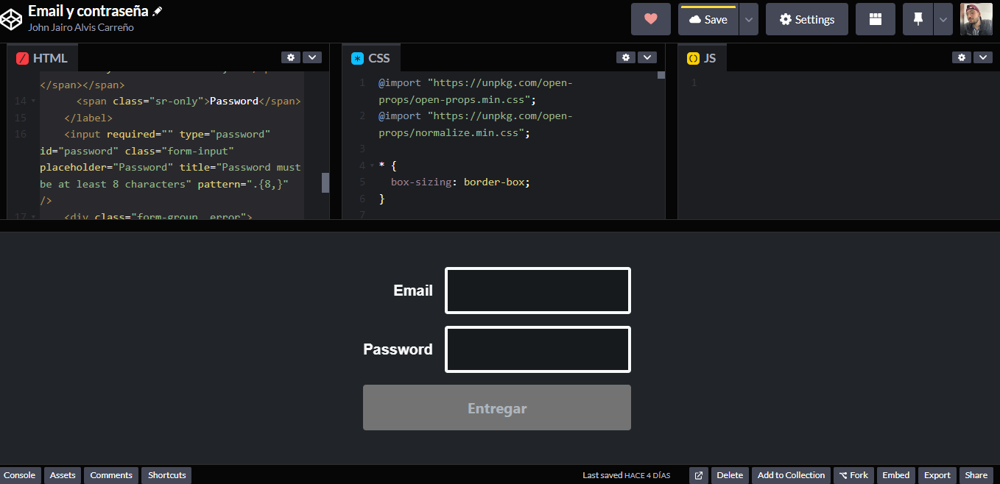
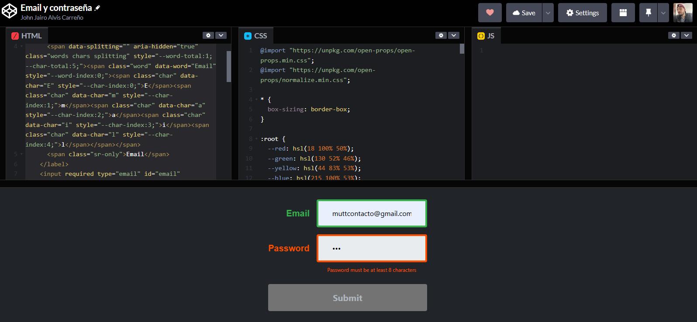
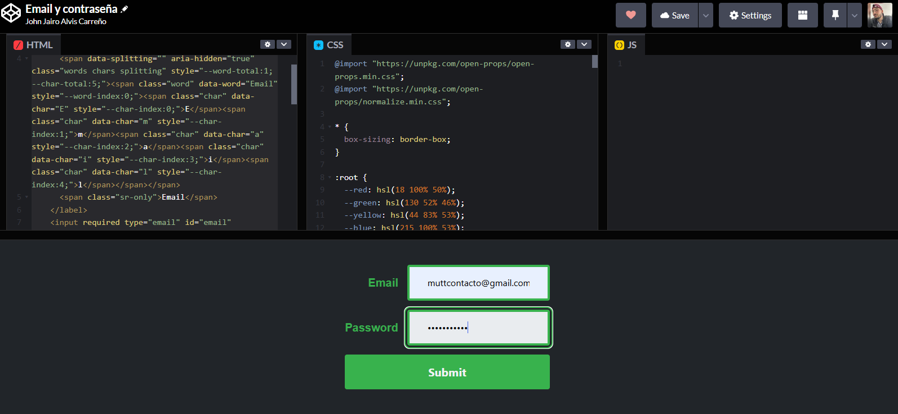

# Login de correo dinamico.

# Descripción del Formulario HTML

Este formulario HTML permite capturar un correo electrónico y una contraseña con validaciones básicas. A continuación, se describe cada parte de la estructura del formulario.

## 1. Formulario Principal (`<form>`)

El formulario utiliza `onsubmit="e => preventDefault()"`, lo cual previene la recarga de la página al enviarlo. Esto permite que los datos se procesen de manera dinámica (por ejemplo, mediante JavaScript), en lugar de enviar y recargar la página.

## 2. Campo de Correo Electrónico

- **Etiqueta (`<label>`)**: La etiqueta para el correo tiene la clase `form-group__label` y utiliza `data-splitting` para dividir cada letra de la palabra "Email" en elementos ``, permitiendo aplicar estilos personalizados a cada carácter.
- **Campo de Entrada (`<input>`)**: Este es el campo donde el usuario ingresa su correo electrónico. Está configurado con el tipo `email`, que automáticamente verifica que el formato sea válido. También tiene el atributo `required`, indicando que debe completarse antes de enviar el formulario.
- **Mensaje de Error**: Un mensaje que se muestra si el usuario no ingresa un correo electrónico válido.

## 3. Campo de Contraseña

- **Etiqueta (`<label>`)**: La palabra "Password" se divide en caracteres individuales para aplicar estilos personalizados a cada letra.
- **Campo de Entrada (`<input>`)**: Este campo utiliza el tipo `password` para ocultar el texto mientras se escribe. También tiene `required` y `pattern=".{8,}"`, lo que exige que la contraseña tenga al menos 8 caracteres. Incluye un `title` que muestra una sugerencia sobre la longitud mínima.
- **Mensaje de Error**: Muestra un mensaje si la contraseña no cumple con el requisito de longitud mínima.

## 4. Botón de Envío

- **Botón (`<button type="submit">`)**: Este botón, al hacer clic, intenta enviar el formulario. Si hay errores de validación, se muestran mensajes de error según los atributos `required` y `pattern`.

### En Conjunto

Este formulario está diseñado para capturar de forma efectiva el correo y la contraseña del usuario, con validaciones básicas de HTML para asegurar que los datos ingresados sean válidos. Además, cada carácter de las etiquetas puede ser estilizado individualmente, permitiendo una mayor personalización.

# Ejemplo de Pantalla de Inicio de Sesión

Este es un ejemplo de la pantalla de inicio de sesión del formulario:

<!---

2.Cuando la contraseña es corta 

3.Al escribir

4.Validación.

Ejemplo del codigo!!!!
https://codepen.io/johnjairoac/pen/bGmrGvz --->

